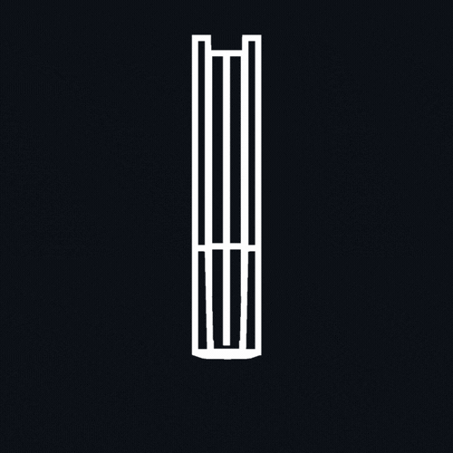
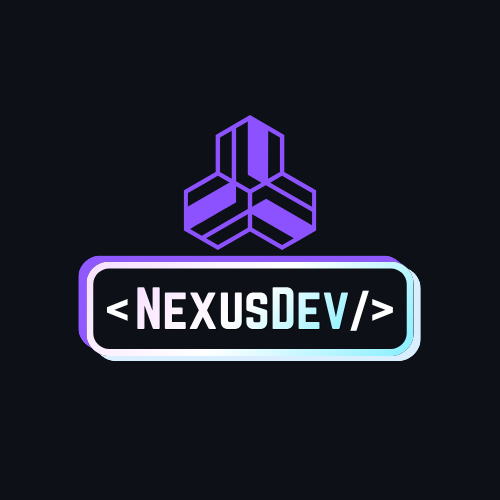
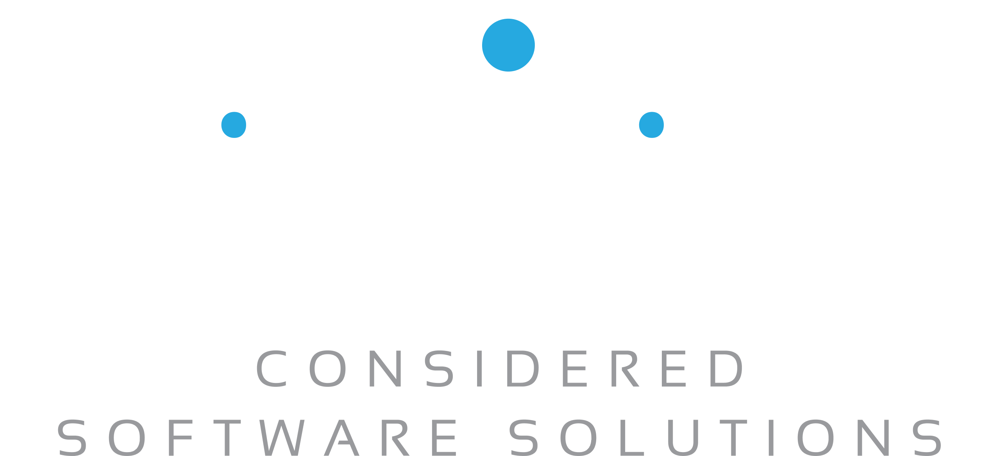
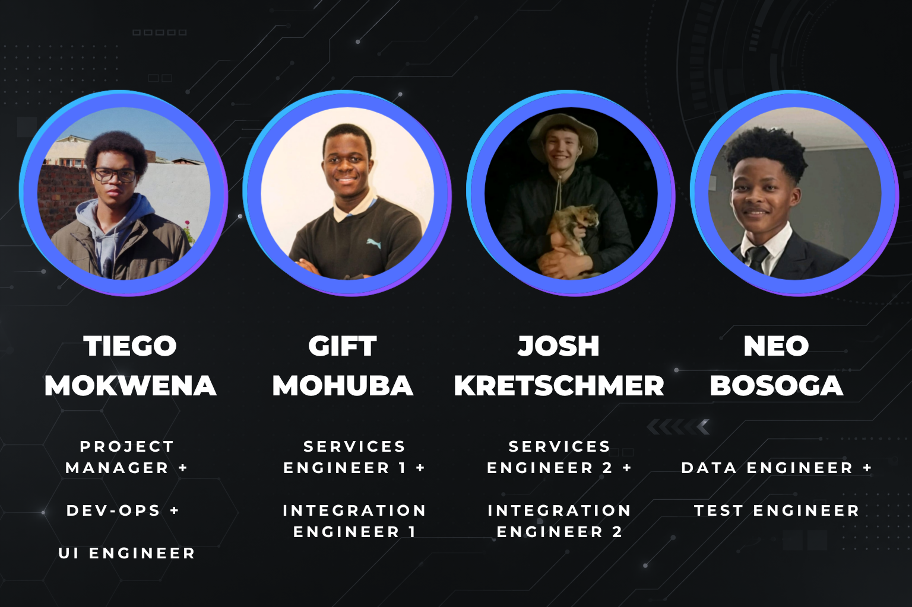

<p align="center">

</p>

<div align="center">
<p align="center">
    <br/>
    
    <br/>
    
    
</p>

<h2 align="center">Made for Students, by Students</h2>

</div>

<p align="center">
  <a href="https://nexusdev-frontend.whitesand-df72b78b.southafricanorth.azurecontainerapps.io/">
    
    Explore Here
  </a>
</p>

<h2 align="center">Presented by <strong>NexusDev</strong><br />

</h2>

<h2 align="center">In Collaboration with <strong>Agile Bridge</strong><br/>

</h2>

<p align="center">

</p>

<div align="center">
    
<h2 align="center">Build & Quality Badges</h2>
    
[](https://codecov.io/gh/COS301-SE-2026/Uni-Textbook-Marketplace)
[](https://github.com/COS301-SE-2026/Uni-Textbook-Marketplace/actions/workflows/ci.yml)
[](https://nodejs.org)
[](https://github.com/COS301-SE-2026/Uni-Textbook-Marketplace/issues)
[](https://github.com/COS301-SE-2026/Uni-Textbook-Marketplace/pulls)
[](https://github.com/COS301-SE-2026/Uni-Textbook-Marketplace/graphs/contributors)
[](https://stats.uptimerobot.com/803622535)
[]()
[]()
[]()
[](./LICENSE)
</div>

<p align="center">

</p>

<div align="center">

## Project Description

**A web-based marketplace where verified university students can buy, sell, or swap second-hand textbooks. The platform features university email verification, structured listings with ISBN, edition, condition and module code, module-aware browsing by faculty and semester, smart filters, and privacy-first in-app messaging.**

Built for [Agile Bridge](https://www2.agilebridge.co.za/) as part of the COS 301 Software Engineering Capstone Project at the University of Pretoria.

</div>

<p align="center">

</p>

<div align="center">
    
<h2 align="center">Tech Stack</h2>

<h3 align="center">Frontend: Considered User Experiences</h3>
<p align="center">

</p>

<h3 align="center">Backend: Stable Foundation</h3>
<p align="center">
<br>
</p>

<h3 align="center">DevOps: Business-Smart Delivery</h3>
<p align="center">

</p>

<h3 align="center">Testing: For Smooth System Assurance</h3>
<p align="center">

</p>

<h3 align="center">Project Management: Via Modern Tech</h3>
<p align="center">

</p>
</div>

<p align="center">

</p>

<div align = "center">
  
  <h2 align="center">Documentation</h2>

### DEMO 2 (Latest Documentation)

| Document | Link |
|---|---|
|  Software Requirements Specifications (SRS) | [View SRS](https://github.com/COS301-SE-2026/Uni-Textbook-Marketplace/blob/main/docs/Demo_2/Software_Requirements_Specifications.pdf) |
|  Software Architecture Specifications (SAS) | [View SAS](https://github.com/COS301-SE-2026/Uni-Textbook-Marketplace/blob/main/docs/Demo_2/Software_Architecture_Specifications.pdf) |
|  Coding Standards | [View Coding Standards](https://github.com/COS301-SE-2026/Uni-Textbook-Marketplace/blob/main/docs/Demo_2/Coding_Standards.pdf) |
|  Testing Policy | [View Testing Policy](https://github.com/COS301-SE-2026/Uni-Textbook-Marketplace/blob/main/docs/Demo_2/Testing_Policy.pdf) |
|  User Manual | [View User Manual](https://github.com/COS301-SE-2026/Uni-Textbook-Marketplace/blob/main/docs/Demo_2/User_Manual.pdf) |
|  Brand Style Guide (Document) | [View Brand Style Guide](https://github.com/COS301-SE-2026/Uni-Textbook-Marketplace/blob/main/docs/Demo_2/Brand_Style_Guide.pdf) |
|  Design Specifications (Design and Wireframes) | [View Design Specifications](https://github.com/COS301-SE-2026/Uni-Textbook-Marketplace/blob/main/docs/Demo_2/Design_Specifications.pdf) |
|  GitHub Project Board | [View Sprint Board](https://github.com/orgs/COS301-SE-2026/projects/64/views/1) |
|  Issue Tracker | [GitHub Issues](../../issues) |
| **Team Collaboration** | [View Group Framework](https://www.notion.so/NexusDev-Project-Management-23862d935436809280d1db1d5c14d0e4?source=copy_link) |
|  Setup Instructions | See [Getting Started](#getting-started) below |

---

### DEMO 1

| Document | Link |
|---|---|
|  Software Requirements Specifications (SRS) | [View SRS](https://github.com/COS301-SE-2026/Uni-Textbook-Marketplace/blob/main/docs/Demo_1/Software_Requirements_Specifications.pdf) |
|  Design Specifications | [View Design Specifications](https://github.com/COS301-SE-2026/Uni-Textbook-Marketplace/blob/main/docs/Demo_1/Design_Specifications.pdf) |

</div>

<p align="center">

</p>

<h2 align="center">Demo Video </h2>
<div align="center">

| Demo Video | Documentation |
| --- | --- |
| [Demo 2 Video](https://drive.google.com/drive/folders/1cTNSV7w1Je5HW7CunI29ZCjxfokRvUN_?usp=sharing) | [Demo 2 Slides](https://github.com/COS301-SE-2026/Uni-Textbook-Marketplace/blob/main/docs/Demo_1/NexusDev_Demo_2_Slides.pdf) |
| [Demo 1 Video](https://drive.google.com/drive/folders/1cTNSV7w1Je5HW7CunI29ZCjxfokRvUN_?usp=sharing) | [Demo 1 Slides](https://github.com/COS301-SE-2026/Uni-Textbook-Marketplace/blob/main/docs/Demo_1/NexusDev_Demo_1_Slides.pdf) |

</div>

<p align="center">

</p>

## Project Structure

<details>
<summary>Click to expand</summary>

```
Uni-Textbook-Marketplace/
├── .github/
│   └── workflows/
├── backend/
│   ├── scripts/
│   ├── src/
│   │   ├── admin/
│   │   │   └── dto/
│   │   ├── auth/
│   │   │   ├── decorator/
│   │   │   ├── dto/
│   │   │   ├── guards/
│   │   │   └── strategies/
│   │   ├── azure/
│   │   ├── books/
│   │   │   └── dto/
│   │   ├── database/
│   │   │   ├── entities/
│   │   │   ├── migrations/
│   │   │   ├── schema/
│   │   │   └── seeds/
│   │   │       └── images/
│   │   ├── email/
│   │   ├── firebase/
│   │   ├── listings/
│   │   │   └── dto/
│   │   ├── messaging/
│   │   │   └── dto/
│   │   ├── modules/
│   │   │   └── dto/
│   │   ├── notifications/
│   │   ├── saved_search/
│   │   │   └── dto/
│   │   ├── shared/
│   │   └── wishlist/
│   └── test/
├── database/
│   └── schema/
├── docs/
│   ├── Demo_1/
│   ├── Demo_2/
│   └── images/
├── frontend/
│   ├── public/
│   │   ├── books/
│   │   └── images/
│   └── src/
│       ├── app/
│       │   ├── admin/
│       │   │   ├── log/
│       │   │   └── review/
│       │   ├── api/
│       │   │   └── listings/
│       │   │       └── [id]/
│       │   ├── auth/
│       │   │   ├── login/
│       │   │   ├── otp/
│       │   │   ├── register/
│       │   │   ├── Registration/
│       │   │   └── resetpassword/
│       │   ├── brand/
│       │   ├── help/
│       │   ├── listings/
│       │   │   ├── [id]/
│       │   │   ├── create/
│       │   │   └── mine/
│       │   ├── messages/
│       │   ├── saved-searches/
│       │   ├── ui-test/
│       │   └── wishlist/
│       ├── components/
│       │   ├── admin/
│       │   │   ├── login/
│       │   │   ├── register/
│       │   │   └── resetpassword/
│       │   ├── icons/
│       │   ├── listings/
│       │   │   └── tests/
│       │   ├── messaging/
│       │   ├── tests/
│       │   ├── ui/
│       │   │   └── tests/
│       │   └── wishlist/
│       ├── context/
│       ├── hooks/
│       ├── lib/
│       │   └── mappers/
│       ├── providers/
│       ├── types/
│       └── utils/
└── messaging/
```

</details>

## Getting Started

### Prerequisites

- Node.js >= 18.0.0
- npm >= 9.0.0
- Docker (for local PostgreSQL)
- Git (system-installed - no GUI clients)

### Installation

```bash
# Clone the repository
git clone https://github.com/COS301-SE-2026/Uni-Textbook-Marketplace.git
cd Uni-Textbook-Marketplace

# Install all dependencies from root (installs both frontend and backend)
npm install
```

### Running locally

```bash
# Start the database
docker compose up -d

# Start the backend (from root)
npm run backend

# Start the frontend (from root)
npm run frontend
```

### Environment variables

Copy the example env files and fill in the values:

```bash
cp backend/.env.example backend/.env
cp frontend/.env.example frontend/.env.local
```

<p align="center">

</p>

## Branching Strategy

We follow **GitHub Flow**:

| Branch | Purpose |
|---|---|
| `main` | Always stable and production-ready. Protected with no direct commits. |
| `develop` | Integration branch for completed features. |
| `feature/[issue-number]-[name]` | New features (e.g. `feature/7-backend-scaffold`) |
| `fix/[issue-number]-[name]` | Bug fixes (e.g. `fix/12-listing-validation`) |
| `docs/[name]` | Documentation updates (e.g. `docs/srs-update`) |
| `test/[name]` | Test additions (e.g. `test/auth-unit-tests`) |

All changes go through a **Pull Request** with at least one review before merging into `develop`. Only sprint-complete code merges into `main`.

> See [CONTRIBUTING.md](./CONTRIBUTING.md) for full branching rules and commit conventions.

<p align="center">

</p>

## Testing

| Layer | Framework |
|---|---|
| Backend unit tests | Jest |
| Backend integration tests | Jest + Supertest |
| Frontend component tests | Jest + React Testing Library |
| End-to-end tests | Cypress |

```bash
# Run backend tests
npm run test:backend

# Run backend tests with coverage
cd backend && npm run test:cov

# Run frontend tests
npm run test:frontend

# Run all tests from root
npm run test:all
```

<p align="center">

</p>

## Architecture Overview

The system follows a **modular monolith** architecture for core features with an **external messaging microservice**:

- **Frontend** : Next.js (React) responsive web app
- **Backend** : NestJS modular monolith (Auth, Listings, Moderation, Modules)
- **Database** : Azure Database for PostgreSQL
- **Messaging** : Firebase Firestore real-time chat (external microservice)
- **Hosting** : Azure Static Web Apps + Azure App Service
- **CI/CD** : GitHub Actions

<p align="center">

</p>

<div align = "center">

## Meet The Team

 

</div>

<div align="center">

| Photo | Team Member | Role | Contributions | Connect |
|:---:|---|---|---|:---:|
|  | **Tiego Mokwena** | Project Manager + UI Engineer + DevOps | Sprint planning, client communication, milestone tracking, frontend UI development (Next.js), CI/CD pipeline (GitHub Actions), Azure deployment, and QA strategy. | [](https://github.com/tl21thebe)<br/>[](https://www.linkedin.com/in/tiego-leroy-t-mokwena-5273413b3) |
|  | **Josh Kretschmer** | Services Engineer 1 + Integration Engineer 1 | Backend API development (NestJS), real-time messaging microservice (Socket.io/Firebase), integration between frontend and backend, Docker environment setup. | [](https://github.com/JoshKretschmer)<br/>[](https://www.linkedin.com/in/josh-kretsch-754804401) |
|  | **Gift Mohuba** | Services Engineer 2 + Integration Engineer 2 | Backend API development, user authentication (JWT), university email verification, API security, integration between frontend and backend. | [](https://github.com/GiftMHB)<br/>[](https://www.linkedin.com/in/gift-mohuba-67097b23b/) |
|  | **Neo Bosoga** | Data Engineer + Test Engineer | PostgreSQL database design and management, complex queries, database indexing, seed data, unit tests, and integration tests. | [](https://github.com/u23591732)<br/>[](https://www.linkedin.com/in/neo-bosoga-67167227a/) |

</div>

<p align="center">

</p>

<div align = "center">

## Contact

| | |
|---|---|
| Team email | nexusdev.cos301@gmail.com |
| Client | Agile Bridge |
| University | University of Pretoria - COS 301 Software Engineering 2026 |

</div>

<p align="center">

</p>

<div align = "center">

*© 2026 NexusDev - University of Pretoria COS 301 Capstone Project*

</div>

<p align="center">

</p>