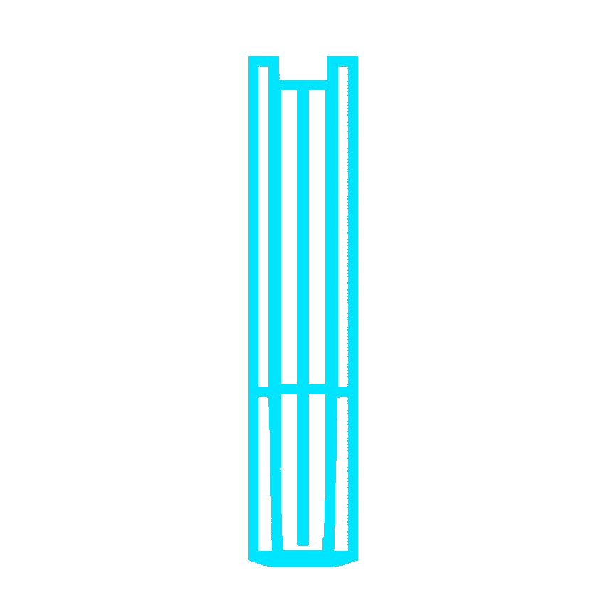

<p align="center">

</p>

<div align="center">
<p align="center">
  
</p>

<p align="center">
  <picture>
    <source media="(prefers-color-scheme: dark)" srcset="./docs/images/students-dark.svg" />
    <source media="(prefers-color-scheme: light)" srcset="./docs/images/students-light.svg" />
    
  </picture>
</p>

<p align="center">
  <picture>
    <source media="(prefers-color-scheme: dark)" srcset="./docs/images/logo-dark.svg" />
    <source media="(prefers-color-scheme: light)" srcset="./docs/images/logo-light.svg" />
    
  </picture>
</p>

<p align="center">
  
</p>

</div>

---
</br>
<p align="center">
  <a href="https://nexusdev-frontend.whitesand-df72b78b.southafricanorth.azurecontainerapps.io/">
    
    Explore Our Web-App Here
  </a>
</p>

<h2 align="center">Presented by <strong>NexusDev</strong><br />
<picture>
  <source media="(prefers-color-scheme: dark)" srcset="./docs/images/NexusDevLOGO_2.png" />
  <source media="(prefers-color-scheme: light)" srcset="./docs/images/_NexusDev_LOGO.png" />
  
</picture>
</h2>

<h2 align="center">In Collaboration with <strong>Agile Bridge</strong><br/>
<picture>
  <source media="(prefers-color-scheme: dark)" srcset="./docs/images/Agile-Bridge-logo-white-2.png" />
  <source media="(prefers-color-scheme: light)" srcset="./docs/images/Agile_bridge_logo_.png" />
  
</picture>
</h2>

<p align="center">

</p>

<div align="center">
    
<h2 align="center">Build & Quality Badges</h2>
    
[](https://codecov.io/gh/COS301-SE-2026/Uni-Textbook-Marketplace)
[](https://github.com/COS301-SE-2026/Uni-Textbook-Marketplace/actions/workflows/ci.yml)
[](https://nodejs.org)
[](https://github.com/COS301-SE-2026/Uni-Textbook-Marketplace/issues)
[](https://github.com/COS301-SE-2026/Uni-Textbook-Marketplace/pulls)
[](https://github.com/COS301-SE-2026/Uni-Textbook-Marketplace/graphs/contributors)
[](https://dashboard.uptimerobot.com/monitors/803622535)
[](https://dashboard.uptimerobot.com/monitors/803622535)
[]()
[]()
[]()
[](./LICENSE)
</div>

<p align="center">

</p>

<div align="center">

## Project Description

**A web-based marketplace where verified university students can buy and/or sell second-hand textbooks. The platform features university email verification, structured listings with ISBN, edition, condition and module code, module-aware browsing by faculty and edition, smart filters, privacy-first in-app messaging, a notification system and admin moderation.**

Built for [Agile Bridge](https://www2.agilebridge.co.za/) as part of the COS 301 Software Engineering Capstone Project at the University of Pretoria.

</div>

<p align="center">

</p>

<div align="center">
    
<h2 align="center">Tech Stack: The Foundation Behind It All</h2>
<p align="center"><sub>Every layer chosen to ship fast without breaking under real students.</sub></p>

<h3 align="center">Frontend: Where Students Meet the Product</h3>
<p align="center">

</p>

<h3 align="center"> Backend: The Engine Room</h3>
<p align="center">

</p>

<h3 align="center">DevOps: Shipping Without Drama</h3>
<p align="center">

</p>

<h3 align="center"> Testing: Trust, Then Verify</h3>
<p align="center">

</p>

<h3 align="center"> Project Management: Staying in Sync</h3>
<p align="center">


</p>
</div>

<p align="center">

</p>

<div align = "center">
  
  <h2 align="center">Documentation</h2>

### DEMO 4 (Latest Documentation)

| Document | Link |
|---|---|
|  Software Requirements Specifications (SRS) | [View SRS](https://github.com/COS301-SE-2026/Uni-Textbook-Marketplace/blob/main/docs/Demo_4/Software_Requirements_Specifications.pdf) |
|  Software Architecture Specifications (SAS) | [View SAS](https://github.com/COS301-SE-2026/Uni-Textbook-Marketplace/blob/main/docs/Demo_4/Software_Architecture_Specifications.pdf) |
|  OpenAPI | [API Service Contracts](https://github.com/COS301-SE-2026/Uni-Textbook-Marketplace/blob/main/docs/OpenAPI/openapi.yaml) |
|  Coding Standards | [View Coding Standards](https://github.com/COS301-SE-2026/Uni-Textbook-Marketplace/blob/main/docs/Demo_4/Coding_Standards.pdf) |
|  Testing Policy | [View Testing Policy](https://github.com/COS301-SE-2026/Uni-Textbook-Marketplace/blob/main/docs/Demo_4/Testing_Policy.pdf) |
|  User Manual | [View User Manual](https://github.com/COS301-SE-2026/Uni-Textbook-Marketplace/blob/main/docs/Demo_4/User_Manual.pdf) |
|  Brand Style Guide (On our Web) | [View Brand Style Guide](https://nexusdev-frontend.whitesand-df72b78b.southafricanorth.azurecontainerapps.io/brand) |
|  Brand Style Guide (Document) | [View Brand Style Guide](https://github.com/COS301-SE-2026/Uni-Textbook-Marketplace/blob/main/docs/Demo_4/Brand_Style_Guide.pdf) |
|  Design Specifications | [View Design Specifications](https://github.com/COS301-SE-2026/Uni-Textbook-Marketplace/blob/main/docs/Demo_4/Design_Specifications.pdf) |
|  GitHub Project Board | [View Sprint Board](https://github.com/orgs/COS301-SE-2026/projects/64/views/1) |
|  Issue Tracker | [GitHub Issues](../../issues) |
| **Team Collaboration** | [View Group Framework](https://www.notion.so/NexusDev-Project-Management-23862d935436809280d1db1d5c14d0e4?source=copy_link) |
|  Setup Instructions | See [Getting Started](#getting-started) below |

---

| | Demo 1 | Demo 2 | Demo 3 |
|---|---|---|---|
| **Documentation** | <br>[SRS](https://github.com/COS301-SE-2026/Uni-Textbook-Marketplace/blob/main/docs/Demo_1/Software_Requirements_Specifications.pdf)<br><br><br>[Design Specifications](https://github.com/COS301-SE-2026/Uni-Textbook-Marketplace/blob/main/docs/Demo_1/Design_Specifications.pdf) | <br>[SRS](https://github.com/COS301-SE-2026/Uni-Textbook-Marketplace/blob/main/docs/Demo_2/Software_Requirements_Specifications.pdf)<br><br><br>[SAS](https://github.com/COS301-SE-2026/Uni-Textbook-Marketplace/blob/main/docs/Demo_2/Software_Architecture_Specifications.pdf)<br><br><br>[Coding Standards](https://github.com/COS301-SE-2026/Uni-Textbook-Marketplace/blob/main/docs/Demo_2/Coding_Standards.pdf)<br><br><br>[Testing Policy](https://github.com/COS301-SE-2026/Uni-Textbook-Marketplace/blob/main/docs/Demo_2/Testing_Policy.pdf)<br><br><br>[User Manual](https://github.com/COS301-SE-2026/Uni-Textbook-Marketplace/blob/main/docs/Demo_2/User_Manual.pdf)<br><br><br>[Brand Style Guide](https://github.com/COS301-SE-2026/Uni-Textbook-Marketplace/blob/main/docs/Demo_2/Brand_Style_Guide.pdf)<br><br><br>[Design Specifications](https://github.com/COS301-SE-2026/Uni-Textbook-Marketplace/blob/main/docs/Demo_2/Design_Specifications.pdf) | <br>[SRS](https://github.com/COS301-SE-2026/Uni-Textbook-Marketplace/blob/main/docs/Demo_3/Software_Requirements_Specifications.pdf)<br><br><br>[SAS](https://github.com/COS301-SE-2026/Uni-Textbook-Marketplace/blob/main/docs/Demo_3/Software_Architecture_Specifications.pdf)<br><br><br>[Coding Standards](https://github.com/COS301-SE-2026/Uni-Textbook-Marketplace/blob/main/docs/Demo_3/Coding_Standards.pdf)<br><br><br>[Testing Policy](https://github.com/COS301-SE-2026/Uni-Textbook-Marketplace/blob/main/docs/Demo_3/Testing_Policy.pdf)<br><br><br>[User Manual](https://github.com/COS301-SE-2026/Uni-Textbook-Marketplace/blob/main/docs/Demo_3/User_Manual.pdf)<br><br><br>[Brand Style Guide](https://github.com/COS301-SE-2026/Uni-Textbook-Marketplace/blob/main/docs/Demo_3/Brand_Style_Guide.pdf)<br><br><br>[Design Specifications](https://github.com/COS301-SE-2026/Uni-Textbook-Marketplace/blob/main/docs/Demo_3/Design_Specifications.pdf) |
| **Demo Recording** | <br>[Video](https://drive.google.com/drive/folders/1cTNSV7w1Je5HW7CunI29ZCjxfokRvUN_?usp=sharing)<br><br><br>[Slides](https://github.com/COS301-SE-2026/Uni-Textbook-Marketplace/blob/main/docs/Demo_1/NexusDev_Demo_1_Slides.pdf) | <br>[Video](https://drive.google.com/drive/folders/1HxUgxsm1RWdTQWn8Jg9vQ6Qaxyj8BgDd?usp=sharing)<br><br><br>[Slides](https://github.com/COS301-SE-2026/Uni-Textbook-Marketplace/blob/main/docs/Demo_2/NexusDev_Demo_2_Slides.pdf) | <br>[Video](https://drive.google.com/drive/folders/1BZxnrHA9spy1miY-c8HXX5PQ4f2y5X9R?usp=sharing)<br><br><br>[Slides](https://github.com/COS301-SE-2026/Uni-Textbook-Marketplace/blob/main/docs/Demo_3/NexusDev_Demo_3_Slides.pdf) |

</div>

---

<p align="center">
  
</p>

<div align="center">
    

## Project Structure
</div>

<details>
<summary>Click to expand</summary>

```
Uni-Textbook-Marketplace/
├── .github/
│   └── workflows/
├── backend/
│   ├── scripts/
│   ├── src/
│   │   ├── admin/
│   │   │   └── dto/
│   │   ├── auth/
│   │   │   ├── decorator/
│   │   │   ├── dto/
│   │   │   ├── guards/
│   │   │   └── strategies/
│   │   ├── azure/
│   │   ├── books/
│   │   │   └── dto/
│   │   ├── database/
│   │   │   ├── entities/
│   │   │   ├── migrations/
│   │   │   ├── schema/
│   │   │   └── seeds/
│   │   │       └── images/
│   │   ├── email/
│   │   ├── firebase/
│   │   ├── listings/
│   │   │   └── dto/
│   │   ├── messaging/
│   │   │   └── dto/
│   │   ├── modules/
│   │   │   └── dto/
│   │   ├── notifications/
│   │   ├── saved_search/
│   │   │   └── dto/
│   │   ├── shared/
│   │   └── wishlist/
│   └── test/
├── database/
│   └── schema/
├── docs/
│   ├── Demo_1/
│   ├── Demo_2/
│   └── images/
├── frontend/
│   ├── public/
│   │   ├── books/
│   │   └── images/
│   └── src/
│       ├── app/
│       │   ├── admin/
│       │   │   ├── log/
│       │   │   └── review/
│       │   ├── api/
│       │   │   └── listings/
│       │   │       └── [id]/
│       │   ├── auth/
│       │   │   ├── login/
│       │   │   ├── otp/
│       │   │   ├── register/
│       │   │   ├── Registration/
│       │   │   └── resetpassword/
│       │   ├── brand/
│       │   ├── help/
│       │   ├── listings/
│       │   │   ├── [id]/
│       │   │   ├── create/
│       │   │   └── mine/
│       │   ├── messages/
│       │   ├── saved-searches/
│       │   ├── ui-test/
│       │   └── wishlist/
│       ├── components/
│       │   ├── admin/
│       │   │   ├── login/
│       │   │   ├── register/
│       │   │   └── resetpassword/
│       │   ├── icons/
│       │   ├── listings/
│       │   │   └── tests/
│       │   ├── messaging/
│       │   ├── tests/
│       │   ├── ui/
│       │   │   └── tests/
│       │   └── wishlist/
│       ├── context/
│       ├── hooks/
│       ├── lib/
│       │   └── mappers/
│       ├── providers/
│       ├── types/
│       └── utils/
└── messaging/
```

</details>
</br>


<p align="center">
  
</p>

<div align="center">
    

## Getting Started
</div>

### Prerequisites
- Node.js >= 18.0.0
- npm >= 9.0.0
- Docker (for local PostgreSQL)
- Git (system-installed - no GUI clients)

---

### Installation

```bash
# Clone the repository
git clone https://github.com/COS301-SE-2026/Uni-Textbook-Marketplace.git
cd Uni-Textbook-Marketplace

# Install all dependencies from root (installs both frontend and backend)
npm install

# Build the Container and Environment
docker compose up --build

# Move to backend
cd backend

# Install the seeding dependencies
npm install ts-node

# Run the Seed data into the database from Docker
docker exec -it nexusdev_backend npx ts-node src/database/seeds/seed-runner.ts
```

---

### Running locally

```bash
# Start the database
docker compose up -d

# Start the backend (from root)
npm run backend

# Start the frontend (from root)
npm run frontend
```

---

### Logging into the web-app (Running Locally)

<details>
<summary>Click to expand</summary>

Student credentials from seed data:

Login (Email):
```bash
student1@tuks.co.za
```

Password:
```bash
Password123
```

---

Admin credentials from seed data:

Login (Email):
```bash
admin1@tuks.co.za
```

Password:
```bash
Admin123
```
</details>

### Environment variables

Copy the example env files and fill in the values:

```bash
cp backend/.env.example backend/.env
cp frontend/.env.example frontend/.env.local
```

<p align="center">
  
</p>

<div align="center">
    

## Branching Strategy
</div>

We follow **GitHub Flow**:

| Branch | Purpose |
|---|---|
| `main` | Always stable and production-ready. Protected with no direct commits. |
| `develop` | Integration branch for completed features. |
| `feature/[issue-number]-[name]` | New features (e.g. `feature/7-backend-scaffold`) |
| `fix/[issue-number]-[name]` | Bug fixes (e.g. `fix/12-listing-validation`) |
| `docs/[name]` | Documentation updates (e.g. `docs/srs-update`) |
| `test/[name]` | Test additions (e.g. `test/auth-unit-tests`) |

All changes go through a **Pull Request** with at least one review before merging into `develop`. Only sprint-complete code merges into `main`.

> See [CONTRIBUTING.md](./CONTRIBUTING.md) for full branching rules and commit conventions.

<p align="center">


</p>

<div align="center">
    

## Testing
</div>

<div align = "center">

| Layer | Framework |
|---|---|
| Backend unit tests | Jest |
| Backend integration tests | Jest + Supertest |
| Frontend component tests | Jest + React Testing Library |
| End-to-end tests | Cypress |

</div>

```bash
# Run backend tests
npm run test:backend

# Run backend tests with coverage
cd backend && npm run test:cov

# Run frontend tests
npm run test:frontend

# Run all tests from root
npm run test:all
```

<p align="center">

</p>

<div align="center">
    

## Meet The Team: NexusDev

 

</div>

<div align="center">

<table>
  <!-- Tiego -->
  <tr>
    <table>
      <tr>
        <td align="center">
          
          <h2>Tiego Mokwena</h2>
          <h5>Team Lead  </br>+ </br>Project Manager  </br>+ </br>UI Engineer </br>+ </br>DevOps Engineer</h5>
          <a href="https://github.com/tl21thebe">
            
          </a>
          <a href="https://www.linkedin.com/in/tiego-leroy-t-mokwena-5273413b3">
            
          </a>
        </td>
        <td align="left" colspan="2">
          <h4>Bio:</h4>
          <h5>I'm a final-year BSc Computer Science student at the University of Pretoria with a background in Biological Sciences, which has shaped my interest in fusing Biology and Software Engineering. I'm drawn to computational solutions for problems in Biology, Health, and BioTech, and I bring hands-on experience in Software Development, Database Systems, Human-Computer Interaction, and Bioinformatics/Computational Biology, applying algorithmic thinking to biological data. Beyond this niche, I'm equally comfortable building multi-purpose software, from full-stack web applications to database-driven systems and enjoy tackling problems across domains, not just BioTech.</h5>
          <h4>Project Contributions:</h4>
          <h6>
          <ul>
            <li>Sprint planning, client communication, and milestone tracking</li>
            <li>Frontend UI development (Next.js, Tailwind) and the notification centre UI</li>
            <li>CI/CD pipeline (GitHub Actions, Cypress end-to-end testing)</li>
            <li>Azure deployment and infrastructure (Container Apps, Blob Storage, custom domain configuration)</li>
            <li>QA strategy</li>
            <li>Computer-vision-assisted listing creation flow (automatic text extraction and photo background removal with user-adjustable cropping) built on Azure AI Vision</li>
          </ul>
          </h6>
        </td>
      </tr>
    </table>
  </tr>
  <!-- Gift -->
  <tr>
    <table>
      <tr>
      <td align="left" colspan="2">
          <h4>Bio:</h4>
          <h5>I am a final year Computer Science with interest in software development and technology. I enjoy building and working on software projects, solving problems, and exploring how different technologies can be used to create practical solutions. I am naturally curious and enjoy learning new concepts, experimenting with different approaches, and understanding how things work rather than simply knowing how to use them. Through my studies and personal projects, I have developed a strong foundation in software development and a desire to continuously improve my skills. I am looking forward to gaining more practical experience, taking on new challenges, and growing into a well rounded software developer.</h5>
          <h4>Project Contributions:</h4>
          <h6>
          <ul>
            <li>Backend API development</li>
            <li>User authentication (JWT) and university email OTP verification</li>
            <li>API security</li>
            <li>Integration between frontend and backend</li>
            <li>Notification system (event-driven alerts across approvals, messages, and listing changes)</li>
            <li>Module-scoped discussion feature, letting students post and answer threaded questions tied to specific course modules, with no schema change needed for arbitrarily deep threads</li>
          </ul>
          </h6>
        </td>
        <td align="center">
          
          <h2>Gift Mohuba</h2>
          <h5>Services Engineer </br>+ </br>Integration Engineer</h5>
          <a href="https://github.com/GiftMHB">
            
          </a>
          <a href="https://www.linkedin.com/in/gift-mohuba-67097b23b/">
            
          </a>
        </td>
      </tr>
    </table>
  </tr>
  <!-- Josh -->
  <tr>
    <table>
      <tr>
        <td align="center">
          
          <h2>Josh Kretschmer</h2>
          <h5>Services Engineer </br>+ </br>Integration Engineer</h5>
          <a href="https://github.com/JoshKretschmer">
            
          </a>
          <a href="https://www.linkedin.com/in/josh-kretsch-754804401">
            
          </a>
        </td>
        <td align="left" colspan="2">
          <h4>Bio:</h4>
          <h5>I'm a final year Information knowledge systems: data science student. The logical side of programming has always been a strong intrigue of mine and Cyber Security and the associated challenges with ensuring the safety (or finding flaws) within systems are the two areas I've enjoyed most throughout my time at university. Stats and maths always came more quickly to me than the software development side of life, but I always appreciate solving a problem or building a project to completion.</h5>
          <h4>Project Contributions:</h4>
          <h6>
          <ul>
            <li>Backend API development (NestJS)</li>
            <li>Real-time messaging microservice (Firebase Firestore)</li>
            <li>Integration between frontend and backend</li>
            <li>Reporting, ban, and appeal moderation workflow (student reports, admin review, ban enforcement, appeal case review)</li>
            <li>Docker environment setup</li>
            <li>Seller-facing interface for the multi-book bundle price optimizer</li>
          </ul>
          </h6>
        </td>
      </tr>
    </table>
  </tr>
  <!-- Neo -->
  <tr>
    <table>
      <tr>
        <td align="left" colspan="2">
          <h4>Bio:</h4>
          <h5>Final-year BSc Information and Knowledge Systems student at the University of Pretoria, passionate about software engineering, data engineering and cybersecurity. I enjoy building backend systems, designing and maintaining PostgreSQL databases, working with APIs, and making software more reliable through unit and integration testing.</h5>
          <h4>Project Contributions:</h4>
          <h6>
          <ul>
            <li>PostgreSQL database design and management, complex queries, indexing, and seed data</li>
            <li>Unit and integration testing</li>
            <li>Non-functional requirement testing lead (load testing with k6, accessibility auditing with axe-core)</li>
            <li>Saved-search alert matching logic</li>
            <li>Appeal case review backend</li>
            <li>Greedy optimization algorithm behind the multi-book bundle price recommender</li>
          </ul>
          </h6>
        </td>
        <td align="center">
          
          <h2>Neo Bosoga</h2>
          <h5>Data Engineer </br>+ </br>Test Engineer</h5>
          <a href="https://github.com/u23591732">
            
          </a>
          <a href="https://www.linkedin.com/in/neo-bosoga-67167227a/">
            
          </a>
        </td>
      </tr>
    </table>
  </tr>
</table>

</div>

<p align="center">

</p>

<div align="center">
    

## Contact
</div>

<div align = "center">

| | |
|---|---|
| Team email | nexusdev.cos301@gmail.com |
| Client | Agile Bridge |
| University | University of Pretoria - COS 301 Software Engineering 2026 |

</div>

<p align="center">

</p>

<div align = "center">

*© 2026 NexusDev - University of Pretoria COS 301 Capstone Project*

</div>

<p align="center">

</p>