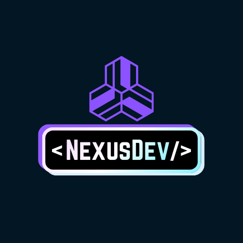

<div align="center">

# Uni Textbook Marketplace


> **A marketplace for students, by students.**

</div>

---

<div align="center">

### Presented by NexusDev



</div>

---

<div align="center">

## Project Description

**A web-based marketplace where verified university students can buy, sell, or swap second-hand textbooks. The platform features university email verification, structured listings with ISBN, edition, condition and module code, module-aware browsing by faculty and semester, smart filters, and privacy-first in-app messaging.**

Built for [Agile Bridge](https://www2.agilebridge.co.za/) as part of the COS 301 Software Engineering Capstone Project at the University of Pretoria.

</div>

---

<div align = "center">

## Documentation

| Document | Link |
|---|---|
|  Software Requirements Specification (SRS) | [View SRS](https://github.com/COS301-SE-2026/Uni-Textbook-Marketplace/blob/main/docs/Software_Requirements_Specifications.pdf) |
|  Design Specifications | [View Design Specifications](https://github.com/COS301-SE-2026/Uni-Textbook-Marketplace/blob/main/docs/Design_Specifications) |
|  User Guide | *Coming soon* |
|  Setup Instructions | See [Getting Started](#getting-started) below |
|  Demo 1 Slides | [View Demo 1 Slides](https://github.com/COS301-SE-2026/Uni-Textbook-Marketplace/blob/main/docs/brand-style-guide.md) |
|  Demo 1 Video | [View Demo 1 Video](https://github.com/COS301-SE-2026/Uni-Textbook-Marketplace/blob/main/docs/brand-style-guide.md) |

</div>

---

<div align = "center">

## Project Board & CI Status

| Resource | Link |
|---|---|
|  GitHub Project Board | [View Sprint Board](https://github.com/orgs/COS301-SE-2026/projects/64/views/1) |
|  Issue Tracker | [GitHub Issues](../../issues) |

</div>

---

<div align = "center">

## Build & Quality Badges

[](https://github.com/COS301-SE-2026/Uni-Textbook-Marketplace/actions/workflows/ci.yml)
[](https://codecov.io/gh/COS301-SE-2026/Uni-Textbook-Marketplace)
[](https://sonarcloud.io/summary/new_code?id=COS301-SE-2026_Uni-Textbook-Marketplace)
[](https://sonarcloud.io/summary/new_code?id=COS301-SE-2026_Uni-Textbook-Marketplace)
[](https://nodejs.org)


[](./LICENSE)

</div>

---

## Getting Started

### Prerequisites

- Node.js >= 18.0.0
- npm >= 9.0.0
- Docker (for local PostgreSQL)
- Git (system-installed - no GUI clients)

### Installation

```bash
# Clone the repository
git clone https://github.com/COS301-SE-2026/Uni-Textbook-Marketplace.git
cd Uni-Textbook-Marketplace

# Install all dependencies from root (installs both frontend and backend)
npm install
```

### Running locally

```bash
# Start the database
docker compose up -d

# Start the backend (from root)
npm run backend

# Start the frontend (from root)
npm run frontend
```

### Environment variables

Copy the example env files and fill in the values:

```bash
cp backend/.env.example backend/.env
cp frontend/.env.example frontend/.env.local
```

---

## Branching Strategy

We follow **GitHub Flow**:

| Branch | Purpose |
|---|---|
| `main` | Always stable and production-ready. Protected with no direct commits. |
| `develop` | Integration branch for completed features. |
| `feature/[issue-number]-[name]` | New features (e.g. `feature/7-backend-scaffold`) |
| `fix/[issue-number]-[name]` | Bug fixes (e.g. `fix/12-listing-validation`) |
| `docs/[name]` | Documentation updates (e.g. `docs/srs-update`) |
| `test/[name]` | Test additions (e.g. `test/auth-unit-tests`) |

All changes go through a **Pull Request** with at least one review before merging into `develop`. Only sprint-complete code merges into `main`.

> See [CONTRIBUTING.md](./CONTRIBUTING.md) for full branching rules and commit conventions.

---

## Testing

| Layer | Framework |
|---|---|
| Backend unit tests | Jest |
| Backend integration tests | Jest + Supertest |
| Frontend component tests | Jest + React Testing Library |
| End-to-end tests | Cypress |

```bash
# Run backend tests
npm run test:backend

# Run backend tests with coverage
cd backend && npm run test:cov

# Run frontend tests
npm run test:frontend

# Run all tests from root
npm run test:all
```

---

## Architecture Overview

The system follows a **modular monolith** architecture for core features with an **external messaging microservice**:

- **Frontend** : Next.js (React) responsive web app
- **Backend** : NestJS modular monolith (Auth, Listings, Moderation, Modules)
- **Database** : Azure Database for PostgreSQL
- **Messaging** : Firebase Firestore real-time chat (external microservice)
- **Hosting** : Azure Static Web Apps + Azure App Service
- **CI/CD** : GitHub Actions

---
<div align = "center">

## The Team

 

</div>

### Tiego Mokwena - Project Manager & UI Engineer & DevOps
> Sprint planning, client communication, milestone tracking, frontend UI development (Next.js), CI/CD pipeline (GitHub Actions), Azure deployment, and QA strategy.

[](https://github.com/tl21thebe)
[](https://www.linkedin.com/in/tiego-leroy-t-mokwena-5273413b3)

---

### Josh Kretschmer - Services Engineer 1 & Integration Engineer 1
> Backend API development (NestJS), real-time messaging microservice (Socket.io/Firebase), integration between frontend and backend, Docker environment setup.

[](https://github.com/JoshKretschmer)
[](https://www.linkedin.com/in/josh-kretsch-754804401)

---

### Gift Mohuba - Services Engineer 2 & Integration Engineer 2
> Backend API development, user authentication (JWT), university email verification, API security, integration between frontend and backend.

[](https://github.com/GiftMHB)
[](https://www.linkedin.com/in/gift-mohuba-67097b23b/)

---

### Neo Bosoga - Data Engineer & Tester
> PostgreSQL database design and management, complex queries, database indexing, seed data, unit tests, and integration tests.

[](https://github.com/u23591732)
[](https://www.linkedin.com/in/neo-bosoga-67167227a/)

---

<div align = "center">

## Contact

| | |
|---|---|
| Team email | nexusdev.cos301@gmail.com |
| Client | Agile Bridge |
| University | University of Pretoria - COS 301 Software Engineering 2026 |

</div>

---

<div align = "center">

*© 2026 NexusDev - University of Pretoria COS 301 Capstone Project*

</div>