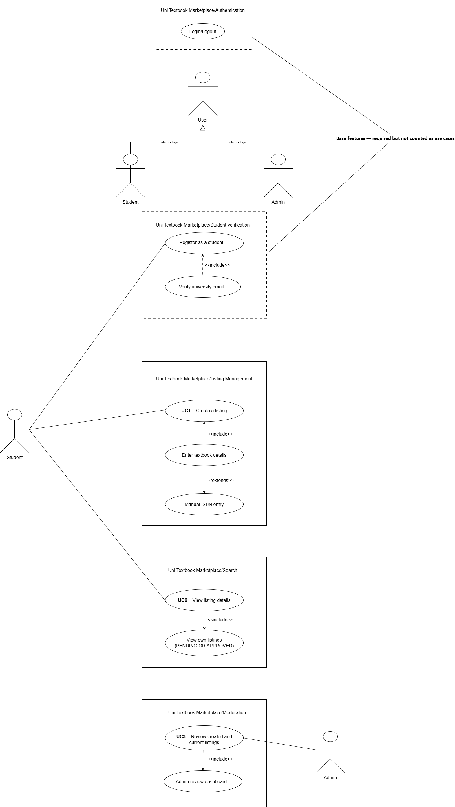
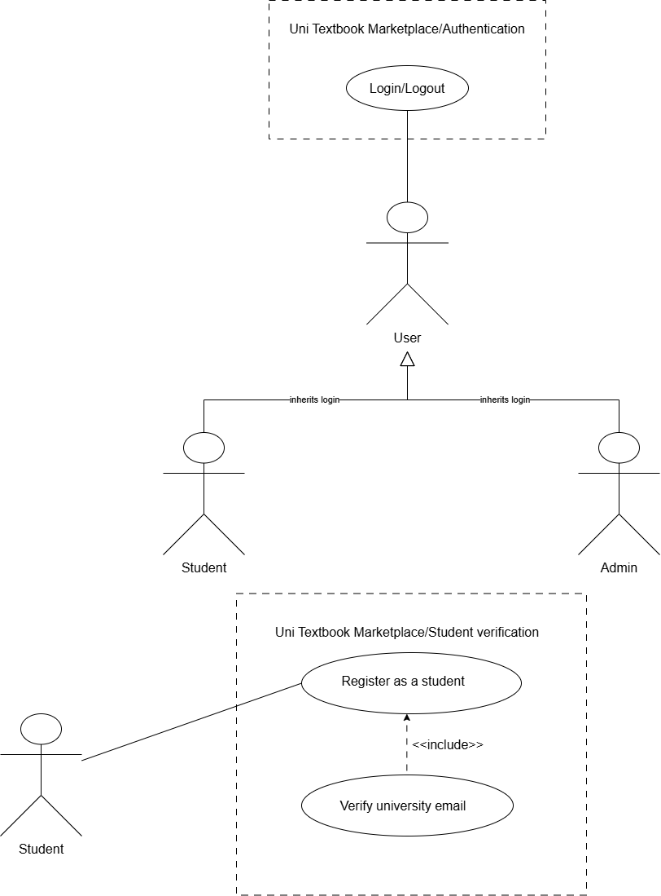
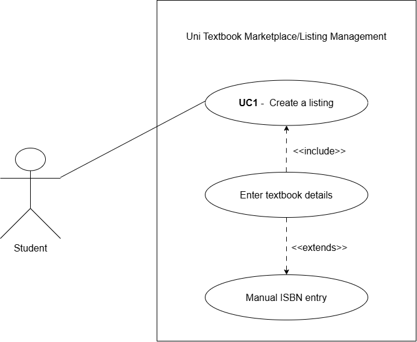
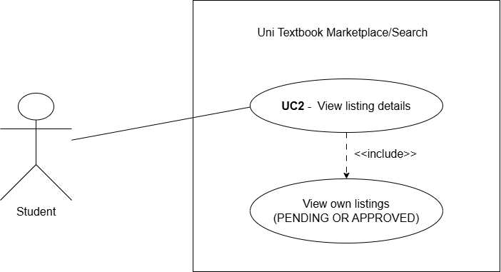
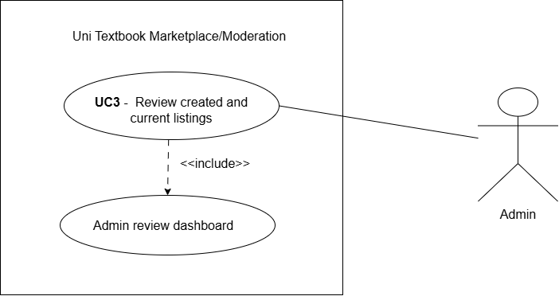

# Software Requirements Specification (SRS)

**Project:** Uni Textbook Marketplace
**Team:** NexusDev
**Client:** Agile Bridge
**University:** University of Pretoria - COS 301 Software Engineering 2026
**Last updated:** 18 May 2026
---

## Table of Contents

1. [Introduction](#1-introduction)
   - 1.1 [Business Need](#11-business-need)
   - 1.2 [Platform Overview](#12-platform-overview)
   - 1.3 [Scope](#13-scope)
   - 1.4 [Constraints](#14-constraints)
   - 1.5 [Definitions and Abbreviations](#15-definitions-and-abbreviations)
2. [User Stories / User Characteristics](#2-user-stories--user-characteristics)
   - 2.1 [Actors](#21-actors)
   - 2.2 [User Stories - Verified Student (Buyer)](#22-user-stories---verified-student-buyer)
   - 2.3 [User Stories - Verified Student (Seller)](#23-user-stories---verified-student-seller)
   - 2.4 [User Stories - Admin](#24-user-stories---admin)
3. [Use Cases + Use Case Diagrams](#3-use-cases--use-case-diagrams)
   - 3.1 [Actor Hierarchy](#31-actor-hierarchy)
   - 3.2 [Use Case Overview](#32-use-case-overview)
   - 3.3 [UC0 - Authentication (Base Feature)](#33-uc0---authentication-base-feature)
   - 3.4 [UC1 - Create a Textbook Listing](#34-uc1---create-a-textbook-listing)
   - 3.5 [UC2 - View Listing Details](#35-uc2---view-listing-details)
   - 3.6 [UC3 - Review Listings (Admin)](#36-uc3---review-listings-admin)
   - 3.7 [Requirements Traceability Matrix](#37-requirements-traceability-matrix)
4. [Functional Requirements](#4-functional-requirements)
   - 4.1 [AuthService](#41-authservice)
   - 4.2 [ListingService](#42-listingservice)
   - 4.3 [ModerationService](#43-moderationservice)
   - 4.4 [ModulesService](#44-modulesservice)
5. [API Service Contracts](#5-api-service-contracts)
6. [Domain Model](#6-domain-model)
   - 6.1 [Entity Descriptions](#61-entity-descriptions)
   - 6.2 [Relationships](#62-relationships)
   - 6.3 [Domain Model Diagram (draw.io)](#63-domain-model-diagram-drawio)
7. [Architectural Requirements](#7-architectural-requirements)
   - 7.1 [Quality Requirements](#71-quality-requirements)
   - 7.2 [Architectural Patterns](#72-architectural-patterns)
   - 7.3 [Design Patterns](#73-design-patterns)
   - 7.4 [Architecture Diagram (draw.io)](#74-architecture-diagram-drawio)
8. [Technology Requirements](#8-technology-requirements)
9. [Appendix](#9-appendix)

---

## 1. Introduction

### 1.1 Business Need

University students across South Africa face significant challenges when
trying to access affordable textbooks each semester. The current landscape
for buying and selling used textbooks is fragmented and inefficient, and
students rely on informal channels such as WhatsApp groups, Facebook
Marketplace, and word of mouth. These platforms were never designed for
academic textbook trading and suffer from three critical problems.

**First, discovery is broken.** Listings lack critical structured details
such as edition, condition, and module code. A student looking for the
fifth edition of a specific textbook for a specific module has no reliable
way to filter for exactly what they need. They are forced to scroll through
irrelevant listings and contact multiple sellers only to discover the
edition is wrong.

**Second, trust is absent.** There is no mechanism to verify that a seller
is a genuine university student. Privacy breaches are common, buyers and
sellers exchange personal contact details with strangers before any
agreement is reached, exposing both parties to risk.

**Third, the process is misaligned with academic needs.** No existing
platform understands the academic calendar, module codes, or faculty
structure. Students cannot browse by module, filter by semester, or find
listings relevant to their specific course.

The Uni Textbook Marketplace directly addresses all three problems by
providing a purpose-built, verified, module-aware platform for university
students.

---

### 1.2 Platform Overview

The Uni Textbook Marketplace is a responsive web-based platform that
enables verified university students to buy, sell, and swap second-hand
textbooks in a safe, structured, and module-aware environment. Students
register using their university email address, which is verified via a
one-time password (OTP). Once verified, students can create structured
textbook listings with details including ISBN, edition, condition,
annotation level, module code, price, and supplementary notes. Buyers can
browse listings filtered by faculty, module code, semester, edition, price
range, and condition. An admin moderation layer ensures listing quality.
All listings enter a pending state and are reviewed by an admin before
becoming visible to other students. The platform is built for Agile Bridge
and hosted on Microsoft Azure.

---

### 1.3 Scope

#### In scope for MVP (Demo 1 - 22 May 2026)

- Student registration with university email domain verification (OTP)
- Student login with JWT-based authentication
- Role-based access control (Student vs Admin)
- Structured textbook listing creation (UC1): ISBN, title, author,
  edition, condition, annotation level, module code, price, has notes
- Listing detail view for students (UC2): view own listings (approved +
  pending) and browse others' approved listings
- Admin listing review dashboard (UC3): approve or reject pending
  listings with soft delete and audit trail
- Module code search-as-you-type lookup, filterable by university
- Basic themes and form validation
- Responsive web interface (mobile + desktop)
- GitHub Actions CI/CD pipeline
- PostgreSQL database with full schema and seed data

#### In scope for later sprints (Demo 2+)

- Privacy-first in-app messaging (Firebase Firestore microservice)
- Smart search filters (price cap, edition, condition, annotation level)
- Saved searches and notifications
- Meetup ratings (successful, no-show, cancelled)
- Wanted board per module
- Swap mode (book-for-book or swap plus cash)
- Pickup preferences (on-campus spots, residences)
- Trust signals (verified badge, account age, listing history)
- Bundle deals per module
- Admin ban and report management tools

#### Explicitly out of scope

- Payment processing: the platform facilitates meetup-based exchanges
  only. No payment gateway will be integrated in any sprint.
- Mobile application: a React Native (Expo) mobile app is a stretch goal
  only, pursued after all core web requirements are delivered.
- ISBN metadata API lookup: manual entry only for Demo 1. External ISBN
  API integration is deferred.
- Online textbook renting system: identified as a potential future feature
  with legal considerations. Stubbed for now.
- Multiple university support beyond UP: initial allowlist is
  @tuks.co.za and @up.ac.za. Multi-institution support is deferred.

---

### 1.4 Constraints

| Constraint | Detail |
|---|---|
| Hosting | Provided by Agile Bridge on Microsoft Azure. The team does not control the infrastructure provider. |
| Authentication | OTP email verification is required. Students must verify their university email before accessing seller and messaging features. |
| Email allowlist | Only @tuks.co.za and @up.ac.za in the initial MVP. The allowlist is configurable for future institutions. |
| No payment processing | The MVP focuses entirely on meetup-based exchanges. No payment gateway, escrow, or financial transaction of any kind is included. |
| ISBN metadata | External ISBN lookup APIs are not integrated for Demo 1. All book details are entered manually by the seller. |
| No mobile app in MVP | The platform is a responsive web application only. React Native is a post-MVP stretch goal. |
| Firebase credentials | Firebase Firestore credentials for the messaging microservice are pending from Agile Bridge. The messaging layer is mocked for Demo 1. |
| Azure environment access | Azure dev and staging environments are provisioned by Agile Bridge. Deployment is blocked until access is granted. |

---

### 1.5 Definitions and Abbreviations

| Term | Definition |
|---|---|
| OTP | One-Time Password. A 6-digit code sent to a student's university email to verify their identity during registration. |
| JWT | JSON Web Token. A signed, stateless token issued by the backend after successful login. It carries the user's ID and role claim. |
| UC | Use Case. A numbered interaction between an actor and the system. |
| UC1 | Create a textbook listing (Student). |
| UC2 | View listing details (Student). |
| UC3 | Review listings (Admin). |
| PENDING | The initial status of every new listing. It is not visible to other students until an admin approves it. |
| APPROVED | A listing that has been reviewed and approved by an admin. It is visible to all verified students. |
| REJECTED | A listing that has been rejected by an admin. It is soft-deleted and retained in the database with an audit log entry. |
| SOFT_DELETED | A listing that has been marked as deleted but is retained in the database. The deleted_at column is set. |
| FR | Functional Requirement. |
| SRS | Software Requirements Specification. |
| API | Application Programming Interface. |
| DTO | Data Transfer Object. A class used to define and validate the shape of request and response payloads. |
| RBAC | Role-Based Access Control. The system grants permissions based on a user's role (Student or Admin). |
| WCAG AA | Web Content Accessibility Guidelines Level AA. The accessibility standard the UI must meet. |
| UP | University of Pretoria. |
| CI/CD | Continuous Integration and Continuous Deployment. Automated pipelines triggered on every pull request. |

---

## 2. User Stories / User Characteristics

### 2.1 Actors

The system has three actor types:

**Verified Student (Buyer)**
A registered and OTP-verified university student who uses the platform
primarily to find and purchase or swap textbooks. They have a university
email address from an allowlisted domain. They browse approved listings,
filter by module code, faculty, edition, and condition, and contact sellers
via the in-app messaging system.

**Verified Student (Seller)**
A registered and OTP-verified university student who creates structured
textbook listings. They provide all required listing details including ISBN,
edition, condition, annotation level, module code, and price. They monitor
the status of their listings and are notified when an admin approves or
rejects a submission.

**Admin**
A platform moderator who reviews all pending listings before they become
visible to students. The admin can approve or reject listings, with
rejection triggering a soft delete and an audit log entry. The admin also
has full browsing access to all approved listings.

---

### 2.2 User Stories - Verified Student (Buyer)

**US-B01**
As a verified student buyer, I want to browse all approved textbook
listings so that I can find a textbook I need without contacting sellers
who do not have what I am looking for.

**US-B02**
As a verified student buyer, I want to filter listings by module code,
faculty, edition, and condition so that I can quickly narrow down the
results to exactly what I need for my specific course.

**US-B03**
As a verified student buyer, I want to view the full details of a listing
including ISBN, edition, condition, annotation level, price, and whether
notes are included so that I can make an informed decision before
contacting the seller.

**US-B04**
As a verified student buyer, I want to see that every seller is a verified
university student so that I can trust that the person I am dealing with
is a genuine member of the university community.

**US-B05**
As a verified student buyer, I want the platform to only show me listings
relevant to my university so that I am not exposed to textbooks from
institutions using different editions or curricula.

---

### 2.3 User Stories - Verified Student (Seller)

**US-S01**
As a verified student seller, I want to create a structured textbook
listing with fields for ISBN, title, author, edition, condition,
annotation level, module code, price, and whether notes are included so
that buyers can find exactly what they need without having to ask
clarifying questions.

**US-S02**
As a verified student seller, I want to see my listings that are pending
admin review, which are clearly marked with a "Pending Review" badge so
that I know my listing has been submitted successfully and understand why
it is not yet visible to other students.

**US-S03**
As a verified student seller, I want to indicate whether my listing
includes supplementary study notes so that buyers who need additional
study materials can identify and prioritise my listing.

**US-S04**
As a verified student seller, I want to view all my active approved
listings in one place so that I can track what I currently have listed
and manage my inventory.

**US-S05**
As a verified student seller, I want to receive a notification when an
admin has approved or rejected my listing so that I know whether my
textbook is now visible to buyers or whether I need to revise my listing
details.

---

### 2.4 User Stories - Admin

**US-A01**
As an admin, I want to see a dashboard of all listings currently in
PENDING status so that I can review new submissions and ensure they meet
platform standards before they become visible to students.

**US-A02**
As an admin, I want to approve a pending listing with a single action so
that verified, accurate listings become available to buyers as quickly as
possible without unnecessary delays.

**US-A03**
As an admin, I want to reject a pending listing with an optional note
explaining the reason so that the seller understands why their listing was
not approved and can correct the issue and resubmit.

**US-A04**
As an admin, I want rejected listings to be soft-deleted and retained in
the database with a deleted_at timestamp and audit log entry so that there
is a complete and recoverable record of all moderation actions for
accountability purposes.

**US-A05**
As an admin, I want to browse all approved listings the same way a student
can so that I can monitor listing quality and identify any listings that
should be removed after approval.

---

## 3. Use Cases + Use Case Diagrams

### 3.1 Actor Hierarchy

The system defines the following actor hierarchy for use in use case
diagrams. The base actor is **User**, which is specialised into
**Verified Student** and **Admin**.


---

### 3.2 Use Case Overview

The following use cases are in scope for Demo 1. Registration and Login
are base features and do not count toward the three required use cases.

| ID | Name | Primary Actor | Status |
|---|---|---|---|
| UC0 | Authentication (Register + Login + OTP) | Unverified Student | Base feature |
| UC1 | Create a textbook listing | Verified Student (Seller) | Counted use case |
| UC2 | View listing details | Verified Student (Buyer/Seller) | Counted use case |
| UC3 | Review listings | Admin | Counted use case |

---

### 3.3 UC0 - Authentication (Base Feature)

#### Use Case Diagram (draw.io)



#### High-Level Description (TUCBW / TUCEW)

**This use case begins when** an unverified student navigates to the
registration page and submits their full name, surname, university name,
and university email address.

**This use case ends when** the student has successfully verified their
OTP, created a password, and received a signed JWT, granting them access
to the platform as a Verified Student.

#### Expanded Use Case Table

| Step | Actor Action | System Response |
|---|---|---|
| 1 | Student enters full name, surname, university, and university email on Step 1 of the registration form. | System validates that all fields are non-empty. |
| 2 | Student submits Step 1. | System stores the name and surname in memory and advances to Step 2. |
| 3 | Student enters university name and university email on Step 2. | System validates email domain against the allowlist (@tuks.co.za, @up.ac.za). |
| 4 | Student submits Step 2. | System generates a 6-digit OTP, stores it in the otps table with a 10-minute expiry, and sends it to the student's university email. System advances to Step 3. |
| 5 | Student enters the 6-digit OTP received by email. | System checks the OTP value and expiry against the otps table. |
| 6 | Student clicks Verify. | System marks the OTP as used, marks the user as verified (is_verified = true), and advances to Step 4. |
| 7 | Student enters a password and confirms it, then checks the Terms of Service checkbox. | System validates password length (minimum 8 characters) and that both passwords match. |
| 8 | Student clicks Register. | System hashes the password, saves the user record to the users table, issues a signed JWT with the student role claim, and redirects to the listings page. |

#### Alternative Flows

**A1 - Invalid email domain:** At step 3, if the email domain is not in the allowlist, the system displays the error "Email must end in @tuks.co.za or @up.ac.za" and does not advance to Step 3.

**A2 - Incorrect OTP:** At step 6, if the OTP value does not match or has expired, the system displays "Invalid or expired OTP" and allows the student to request a new code.

**A3 - Passwords do not match:** At step 7, if the two password fields do not match, the system displays "Passwords do not match" and does not submit.

---

### 3.4 UC1 - Create a Textbook Listing

#### Use Case Diagram



#### High-Level Description (TUCBW / TUCEW)

**This use case begins when** a verified, authenticated student navigates
to the Create Listing page and begins filling in the listing form.

**This use case ends when** the student submits the form and the system
creates a new listing record with PENDING status and displays a
confirmation with a "Pending Review" badge.

#### Expanded Use Case Table

| Step | Actor Action | System Response |
|---|---|---|
| 1 | Authenticated student navigates to Create Listing. | System renders the listing form. The JWT is validated by the JwtAuthGuard. |
| 2 | Student enters ISBN. | System accepts the value. ISBN lookup is manual for Demo 1. |
| 3 | Student enters title, author, and edition. | System validates that title and edition are non-empty. |
| 4 | Student selects condition from dropdown (new, good, fair, poor). | System stores the selected value. |
| 5 | Student selects annotation level (none, light, heavy). | System stores the selected value. |
| 6 | Student begins typing a module code in the module search field. | System queries GET /modules?search=[query]&university=UP and displays matching module codes as a dropdown. |
| 7 | Student selects a module from the dropdown. | System stores the module_id foreign key. |
| 8 | Student enters price in Rands. | System validates that price is a positive decimal value. |
| 9 | Student optionally toggles has_notes. | System stores the boolean value. |
| 10 | Student optionally uploads one or more photos. | System stores the photo URLs in the photo_urls array. |
| 11 | Student clicks Submit. | System sends POST /listings with the JWT in the Authorization header. Backend validates the DTO, creates the listing record with status = PENDING, and returns the new listing ID. |
| 12 | | System displays a success message: "Your listing has been submitted and is awaiting admin review." The listing is visible on the student's My Listings page with a PENDING badge. |

#### Alternative Flows

**A1 - Not authenticated:** At step 1, if the JWT is absent or expired, the JwtAuthGuard returns 401 and the frontend redirects to the login page.

**A2 - Missing required fields:** At step 11, if any required field (title, edition, condition, module, price) is empty, the system returns a 400 Bad Request with field-level validation errors. The form highlights the invalid fields.

**A3 - Invalid price:** At step 8, if the price is zero or negative, the system displays "Price must be greater than zero."

---

### 3.5 UC2 - View Listing Details

#### Use Case Diagram (draw.io)



#### High-Level Description (TUCBW / TUCEW)

**This use case begins when** a verified, authenticated student navigates
to the listings page or their personal My Listings page.

**This use case ends when** the student has viewed the full structured
detail page of a specific listing, including all book metadata, price,
condition, annotation level, and listing status.

#### Expanded Use Case Table

| Step | Actor Action | System Response |
|---|---|---|
| 1 | Student navigates to Browse Listings. | System calls GET /listings, which returns all APPROVED listings. Each listing card shows title, edition, price, condition, and module code. |
| 2 | Student optionally applies filters (module code, faculty, price range, condition). | System re-queries with filter parameters and updates the listing grid. |
| 3 | Student clicks a listing card. | System calls GET /listings/:id. The backend returns the full listing object including all fields. |
| 4 | | System renders the listing detail page showing: title, author, ISBN, edition, condition, annotation level, has_notes, module code, price, photo carousel, and seller's verified badge. |
| 5 | Student navigates to My Listings. | System calls GET /listings/mine. The backend uses the JWT to identify the seller and returns both APPROVED and PENDING listings belonging to that student. |
| 6 | | System renders the My Listings page. PENDING listings display a "Pending Review" badge. APPROVED listings display an "Approved" badge. |

#### Alternative Flows

**A1 - Listing not found:** At step 3, if the listing ID does not exist or belongs to a REJECTED or SOFT_DELETED listing, the system returns 404 and displays "Listing not found."

**A2 - Unauthenticated access:** At step 1, if the JWT is absent, the frontend redirects to login. The browse endpoint requires authentication.

---

### 3.6 UC3 - Review Listings (Admin)

#### Use Case Diagram (draw.io)



#### High-Level Description (TUCBW / TUCEW)

**This use case begins when** an authenticated admin navigates to the
Admin Review Dashboard and sees the list of all PENDING listings.

**This use case ends when** the admin has either approved a listing
(setting its status to APPROVED and making it visible to students) or
rejected it (setting its status to REJECTED, triggering a soft delete, and
recording a full audit log entry).

#### Expanded Use Case Table

| Step | Actor Action | System Response |
|---|---|---|
| 1 | Admin navigates to the Admin Dashboard. | System calls GET /admin/listings/pending using the admin's JWT. The RoleGuard validates the admin role claim. Backend returns all listings with status = PENDING. |
| 2 | | System renders the pending listings dashboard as a table. Each row shows: title, seller name, module code, edition, condition, price, and submission date. |
| 3 | Admin clicks on a listing row to view full details. | System calls GET /listings/:id and renders the full listing detail page. |
| 4a | Admin clicks Approve. | System calls PATCH /admin/listings/:id/approve. |
| 5a | | Backend sets listing.status = APPROVED, sets listing.reviewed_by = admin UUID, sets listing.reviewed_at = now(), and writes an audit_log entry with action = APPROVED. Returns 200. |
| 6a | | System removes the listing from the pending dashboard and displays a success toast: "Listing approved." |
| 4b | Admin clicks Reject, optionally entering a reason. | System calls PATCH /admin/listings/:id/reject with an optional notes field in the request body. |
| 5b | | Backend sets listing.status = REJECTED, sets listing.deleted_at = now(), sets listing.reviewed_by = admin UUID, sets listing.reviewed_at = now(), and writes an audit_log entry with action = REJECTED and the admin's notes. Returns 200. |
| 6b | | System removes the listing from the pending dashboard and displays a success toast: "Listing rejected." |

#### Alternative Flows

**A1 - Not an admin:** At step 1, if the JWT does not carry the admin role claim, the RoleGuard returns 403 Forbidden. The frontend redirects to the student listings page.

**A2 - Listing already reviewed:** At step 4a or 4b, if the listing has already been approved or rejected (e.g. by another admin session), the backend returns 409 Conflict. The system displays "This listing has already been reviewed."

---

### 3.7 Requirements Traceability Matrix

| Requirement | UC0 | UC1 | UC2 | UC3 |
|---|---|---|---|---|
| FR-AUTH-01 Register | X | | | |
| FR-AUTH-02 OTP Verification | X | | | |
| FR-AUTH-03 Login + JWT | X | | | |
| FR-AUTH-04 Domain Allowlist | X | | | |
| FR-LIST-01 Create Listing | | X | | |
| FR-LIST-02 Module Search | | X | | |
| FR-LIST-03 Get All Approved | | | X | |
| FR-LIST-04 Get My Listings | | | X | |
| FR-LIST-05 Get Listing by ID | | | X | X |
| FR-MOD-01 Get Pending Listings | | | | X |
| FR-MOD-02 Approve Listing | | | | X |
| FR-MOD-03 Reject + Soft Delete | | | | X |
| FR-MOD-04 Audit Log | | | | X |

---

## 4. Functional Requirements

### 4.1 AuthService

**FR-AUTH-01 - Student Registration**
The system shall allow a student with a valid university email address to
register by providing their full name, surname, university name, and email.
The system shall reject any email address whose domain is not in the
configured allowlist.

**FR-AUTH-02 - OTP Generation and Verification**
The system shall generate a cryptographically random 6-digit OTP upon
registration and send it to the student's university email address. The OTP
shall expire after 10 minutes. The system shall mark the OTP as used after
successful verification to prevent reuse.

**FR-AUTH-03 - Login and JWT Issuance**
The system shall authenticate a registered, verified student by validating
their email and hashed password. On success, the system shall issue a signed
JWT containing the user's UUID and role claim (student or admin). The JWT
shall be used on all subsequent authenticated requests.

**FR-AUTH-04 - Email Domain Allowlist**
The system shall enforce an email domain allowlist. For Demo 1, only
@tuks.co.za and @up.ac.za are permitted. The allowlist shall be
configurable in the backend environment variables without requiring a code
change.

**FR-AUTH-05 - Role-Based Access Control**
The system shall enforce role-based access control on all protected
endpoints using a JWT guard and a role guard. Endpoints designated for
Admin only shall return 403 Forbidden if accessed with a Student JWT.

---

### 4.2 ListingService

**FR-LIST-01 - Create Listing**
The system shall allow a verified, authenticated student to create a
textbook listing by submitting a DTO containing: ISBN, title, author,
edition (integer), condition (new / good / fair / poor), annotation_level
(none / light / heavy), module_id (foreign key), price (positive decimal),
has_notes (boolean), and photo_urls (array of strings). The listing shall
be created with status = PENDING.

**FR-LIST-02 - Module Code Search**
The system shall provide a search-as-you-type module code endpoint. The
endpoint shall accept a search string and an optional university filter and
return matching module records. The response shall include module code,
module name, and faculty.

**FR-LIST-03 - Get All Approved Listings**
The system shall return all listings with status = APPROVED when a verified
student calls the browse endpoint. Soft-deleted, rejected, and pending
listings shall not be returned.

**FR-LIST-04 - Get My Listings**
The system shall return all listings belonging to the authenticated student,
including both APPROVED and PENDING listings. The response shall include
the listing status so the frontend can render appropriate badges.

**FR-LIST-05 - Get Listing by ID**
The system shall return the full listing detail object for a given listing
ID. If the listing is REJECTED or SOFT_DELETED, the system shall return
404 Not Found. If the listing is PENDING, it shall only be accessible to
its owner or an admin.

---

### 4.3 ModerationService

**FR-MOD-01 - Get Pending Listings**
The system shall return all listings with status = PENDING when an
authenticated admin calls the pending listings endpoint. The response shall
include full listing detail plus the seller's display name.

**FR-MOD-02 - Approve Listing**
The system shall allow an authenticated admin to approve a pending listing.
On approval, the system shall set status = APPROVED, reviewed_by = admin
UUID, and reviewed_at = current timestamp. An audit log entry shall be
written with action = APPROVED.

**FR-MOD-03 - Reject Listing with Soft Delete**
The system shall allow an authenticated admin to reject a pending listing
with an optional rejection reason. On rejection, the system shall set
status = REJECTED, deleted_at = current timestamp, reviewed_by = admin
UUID, reviewed_at = current timestamp, and create an audit log entry with
action = REJECTED and the optional notes. The listing record shall be
retained in the database.

**FR-MOD-04 - Audit Log Integrity**
Every moderation action (approve or reject) shall produce a corresponding
audit_log record. The audit log shall record: entity_type, entity_id,
action, performed_by (admin UUID), performed_at, and notes.

---

### 4.4 ModulesService

**FR-MOD-S01 - Module Search Endpoint**
The system shall expose a GET /modules endpoint that accepts a search query
parameter and an optional university parameter. The endpoint shall perform
a case-insensitive prefix search on module code and module name.

**FR-MOD-S02 - Module Seed Data**
The system shall seed the database with a representative set of University
of Pretoria module codes across all faculties for Demo 1. The seed data
shall include module code, module name, faculty, and semester.

---

## 5. API Service Contracts


---

## 6. Domain Model

### 6.1 Entity Descriptions

**University**
Represents an institution registered on the platform. Stores the
institution name and the email domain used for verification. Each user
belongs to a university.

**User**
Represents a registered platform participant. Stores identity information
(name, email, password hash), verification status, role (student or admin),
and faculty. A user can have many listings (as a seller) and many audit log
entries (as an admin who performed moderation actions). A user's
university_id is set to NULL if the university record is deleted
(ON DELETE SET NULL) so the user account is preserved.

**OTP**
Represents a one-time password record created during registration. Stores
the target email, the 6-digit code, the expiry timestamp, a used flag, and
a creation timestamp. Each OTP is consumed after a single successful
verification.

**Module**
Represents a university module (course). Stores the module code (e.g.
COS301), module name, faculty, semester, and a foreign key to the
university it belongs to. A module can have many listings associated with
it.

**Book**
Represents the physical book being listed. Stores ISBN, title, author,
edition, and publisher. A book can appear in multiple listings (e.g. the
same textbook listed by multiple sellers).

**Listing**
The central entity of the platform. Represents one student's offer to sell
a specific book. A listing links a seller (User), a book (Book), and a
module (Module). It stores condition, annotation level, price, has_notes,
photo_urls, and a status (PENDING, APPROVED, REJECTED, SOFT_DELETED). It
also stores reviewed_by (admin UUID), reviewed_at, deleted_at, and
created_at for a full lifecycle record.

**AuditLog**
Records every moderation action performed by an admin. Stores entity_type,
entity_id (the listing UUID), action (APPROVED or REJECTED), performed_by
(admin UUID), performed_at, and optional notes. Provides an immutable
accountability trail.

---

### 6.2 Relationships

| Relationship | Type | Detail |
|---|---|---|
| University to User | One to Many | One university has many users. user.university_id FK to universities.id ON DELETE SET NULL. |
| University to Module | One to Many | One university has many modules. module.university_id FK to universities.id. |
| User to Listing | One to Many | One user (seller) has many listings. listing.seller_id FK to users.id. |
| Book to Listing | One to Many | One book can appear in many listings. listing.book_id FK to books.id. |
| Module to Listing | One to Many | One module can have many listings. listing.module_id FK to modules.id. |
| User to AuditLog | One to Many | One admin performs many audit log entries. audit_log.performed_by FK to users.id. |

---

### 6.3 Domain Model Diagram (draw.io)

```

```

---

## 7. Architectural Requirements

### 7.1 Quality Requirements

| Quality Attribute | Requirement | Measure |
|---|---|---|
| Performance | Multi-filter listing search must return results quickly. | Less than 100ms query execution time. Validated in the pre-sprint technical spike using PostgreSQL composite indexes on module_id+price, condition, annotation_level, and status columns. |
| Reliability | Core listing and auth features must remain available if the messaging service is down. | Graceful degradation. The Firebase Firestore messaging service is an external microservice. Its failure does not affect the listings, auth, or moderation modules. |
| Scalability | The API layer must be stateless to support horizontal scaling. | JWT-based authentication with no server-side session state. Any instance of the backend can handle any request. |
| Security | Only verified university students can create listings. Only admins can approve or reject listings. | OTP verification enforced at registration. JWT role claims validated by JwtAuthGuard and RoleGuard on all protected routes. |
| Maintainability | The codebase must be modular and allow changes to one service without affecting others. | NestJS modular monolith. Auth, Listings, Moderation, and Modules are independent bounded modules with no circular dependencies. |
| Accessibility | The UI must meet WCAG AA contrast standards. | SonarCloud accessibility checks enforced on all pull requests. All foreground and background colour pairs in globals.css have been verified to meet the 4.5:1 minimum contrast ratio. |
| Testability | Backend services must have measurable test coverage. | Jest unit tests with a minimum target of 60% line coverage by Demo 1. --passWithNoTests removed when real tests are added. |

---

### 7.2 Architectural Patterns

**Modular Monolith (Core Backend)**

The backend is a NestJS modular monolith. Rather than building multiple
independently deployed microservices from the start, all core domain logic
(Auth, Listings, Moderation, Modules) is contained in a single NestJS
application organised as bounded modules. Each module has its own
controller, service, and module definition file with no cross-module
service injection. This pattern was chosen because the team is small (5
members), the domain is well-understood, and premature microservice
decomposition introduces operational overhead that is not justified at this
stage. The modular structure makes a future migration to microservices
straightforward if needed.

**External Microservice (Messaging)**

The in-app messaging feature is architected as an external microservice
backed by Firebase Firestore. It is intentionally isolated from the core
monolith. The frontend communicates directly with Firestore via the
Firebase client SDK. The NestJS backend does not proxy messaging requests.
This architectural decision ensures that a Firestore outage does not
affect any core platform functionality (graceful degradation). For Demo 1,
the messaging service is mocked.

**Stateless API Layer**

The NestJS API is fully stateless. Authentication state is carried
entirely in the JWT issued at login. No session data is stored server-side.
This design supports horizontal scaling: multiple API instances can run
behind a load balancer without sticky sessions or shared session storage.

**Read-Heavy Performance Strategy**

The listing browse feature is read-heavy. The database schema includes
composite and single-column indexes on the columns most commonly used in
WHERE clauses and ORDER BY operations: module_id+price, condition,
annotation_level, status, seller_id, reviewed_by, isbn, edition, and title.
These indexes were validated in a pre-sprint technical spike which
demonstrated sub-0.1ms query performance on a populated dataset.

---

### 7.3 Design Patterns

**Repository Pattern (TypeORM)**

All database access is mediated through TypeORM repositories injected into
NestJS service classes. No service writes raw SQL. This separates business
logic from persistence logic and makes it possible to swap the underlying
database engine without changing service code. TypeORM entity classes map
directly to the PostgreSQL schema defined in database/schema/schema.sql.

**Guard Pattern (JWT + Role)**

NestJS Guards are used to enforce authentication and authorisation on all
protected routes. The JwtAuthGuard validates the Bearer token on every
request to a protected endpoint. The RoleGuard checks the role claim
inside the JWT against the required role defined by the @Roles() decorator
on the controller method. This pattern centralises access control logic so
it does not need to be repeated inside service methods.

**DTO Pattern (class-validator)**

All inbound request payloads are typed using NestJS Data Transfer Object
classes decorated with class-validator annotations. The ValidationPipe
applied globally at the NestJS application level rejects any request whose
body does not conform to the DTO schema, returning a structured 400 Bad
Request response before the request reaches the service layer.

**Observer Pattern (Notifications)**

Listing status change notifications (approve or reject) are implemented
using NestJS's event emitter module. When the ModerationService approves
or rejects a listing, it emits a domain event. A notification listener
subscribes to these events and dispatches a notification to the relevant
seller. This decouples the moderation logic from the notification delivery
mechanism.

---

### 7.4 Architecture Diagram (draw.io)

```


---

## 8. Technology Requirements

| Layer | Technology | Version | Justification |
|---|---|---|---|
| Frontend | Next.js + React + TypeScript | 16.x | Server-side rendering improves performance for read-heavy listing browsing. App Router enables per-page loading states. TypeScript enforces type safety across the codebase. |
| Frontend Styling | Tailwind CSS | 4.x | Utility-first approach allows rapid UI development. Responsive design utilities are built in. Token-based theming aligns with the Agile Bridge brand style guide. |
| Backend | NestJS + TypeScript | Latest stable | Modular architecture maps directly to the bounded module pattern. First-class TypeScript support. Decorators for guards, DTOs, and Swagger reduce boilerplate. |
| Database | PostgreSQL on Azure | 16 | Relational model suits the structured listing schema. Full-text search and composite index support meet performance requirements. Azure-native managed instance removes infrastructure overhead. |
| ORM | TypeORM | 0.3.x | First-class NestJS integration. Entity-based migration generation. Repository pattern support. |
| Authentication | Azure B2C + JWT | N/A | OTP email verification via Azure B2C satisfies the client's university email requirement. Stateless JWT eliminates server-side session management. |
| Messaging | Firebase Firestore | N/A | Real-time updates for in-app chat without polling. External to the core API so its failure does not affect other features. Credentials pending from Agile Bridge. Mocked for Demo 1. |
| Hosting (Backend) | Azure App Service | N/A | Client-provided Azure infrastructure. Node.js runtime. Auto-scaling support. |
| Hosting (Frontend) | Azure Static Web Apps | N/A | Client-provided Azure infrastructure. Global CDN. Automatic HTTPS. |
| CI/CD | GitHub Actions | N/A | Triggered on push and pull request. Two jobs: backend (lint, test, build) and frontend (lint, build). SonarCloud and Codecov integrations active on every PR. |
| Testing (Backend) | Jest + Supertest | 30.x | NestJS first-class support. Supertest enables controller-level integration testing without a running server. |
| Testing (Frontend) | Jest + React Testing Library | 30.x | Component testing aligned with React best practices. |
| Code Quality | SonarCloud | N/A | Static analysis, security hotspot detection, duplicate code detection, and WCAG accessibility checks enforced as a PR Quality Gate. |
| API Documentation | Swagger (OpenAPI) | N/A | Auto-generated from NestJS controller decorators. Hosted at /api/docs. |
| Package Management | npm workspaces | 10.x | Single root package-lock.json manages both frontend and backend dependencies in the monorepo. |

---

## 9. Appendix

### 9.1 Version History

| Version | Date | Author | Changes |
|---|---|---|---|
| 1.0 | 6 May 2026 | Tiego Mokwena | Initial document. Sections 1 and 2 complete. Sections 3-8 stubs. |
| 2.0 | 18 May 2026 | Tiego Mokwena | All sections completed. Use cases, functional requirements, API contracts, domain model, architecture, and technology sections finalised for Demo 1. |

### 9.2 Client Meeting Notes Reference

The following decisions were made and confirmed at the client requirements
meeting with Kyle Marshall and Dominique da Silva at Agile Bridge head
office on 30 April 2026.

- Scope unchanged from tender document.
- Three use cases signed off: UC1 (Create listing), UC2 (View listing), UC3 (Review listings).
- Registration and login are base features and do not count toward the three use cases.
- Authentication method: Azure B2C OTP sent to university email.
- Email allowlist: @tuks.co.za and @up.ac.za only.
- Module code search-as-you-type lookup, filterable by university.
- Listing lifecycle uses soft delete inheriting from main audit log.
- Branding: follow Agile Bridge website (www2.agilebridge.co.za).
- Renting feature: stubbed for now due to legal considerations.
- Nice-to-haves (wanted board, swap mode, pickup preferences): not elevated for Demo 1.

---

*Copyright 2026 NexusDev - University of Pretoria COS 301 Capstone Project*
*This document is version-controlled in the GitHub repository under /docs/markdowns/srs.md*